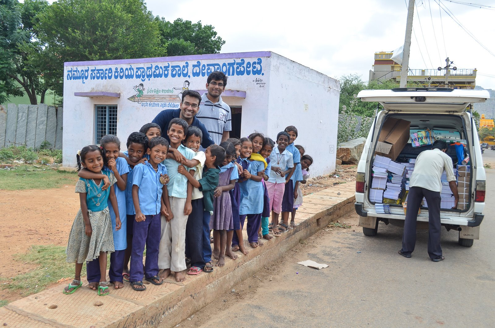

---
layout: page
title: ""
--- 

<html>
<head>
<meta name="viewport" content="width=device-width, initial-scale=1">

</head>
<body>

   
  

Hi, thank you for visiting my website. I am a postdoctoral research associate in the <a href="https://efmlab.nd.edu/">Environmental Fluid Mechanics Laboratory</a> at the <a href="https://www.nd.edu/"> University of Notre Dame</a>. I am a part of the <a href="https://efmlab.nd.edu/research/astral/"> ASTRaL </a> and  <a href="https://efmlab.nd.edu/research/miso-bob/"> MISO-BOB </a> projects.  I am trying to understand the structure and evolution of the atmospheric boundary layer using observations from ships and aircraft. I am also involved in the <a href = "https://efmlab.nd.edu/research/swex/">SWEX</a> project, which studies the downslope windstorms over the mountains of Southern California. These hot and dry winds fan the  wildfires in this region. Previously, I was at the <a href="https://ncas.ac.uk/"> National Centre for Atmospheric Science (NCAS)</a>, University of Leeds, where I studied the interaction between monsoonal jet and the Western Ghats from observations and model simulations as a part of the <a  href="http://www.met.reading.ac.uk/~sws05agt/improve/"> IMPROVE project </a> 

I did my Ph.D. at the <a href="https://caos.iisc.ac.in/"> Centre for Atmospheric and Oceanic Sciences</a>, Indian Institute of Science, Bangalore. For my Ph.D. thesis, I wrote an <a href="https://jayphd.github.io/tracking/">automated cloud-tracking algorithm </a> to study the organization of deep convection from the INSAT satellite data. With the help of WRF model simulations, I also proposed an orographic blocking mechanism for the extreme rainfall events responsible for the <a href="https://en.wikipedia.org/wiki/2015_South_India_floods"> 2015 South India floods</a>. This was the first <a href="https://doi.org/10.1175/MWR-D-16-0473.1"> study</a> to link extreme rainfall over the east coast of India to the Eastern Ghats mountains. 
 



<h2> Research Interest: </h2>
<ul>
<li> Tropical Dynamics</li>
<li> Orographic Effects</li> 
<li> Mesocale Dynamics </li>
<li> Numerical Weather Prediction </li>
</ul> 
  

<h2>Education:</h2> 
<ul>
<li> Ph.D. (2020), Indian Institute of Science, Bengaluru, India </li>
<li> M.Tech. (2012), Indian Institute of Science, Bengaluru, India </li>
<li> B.E. (2008), Sardar Patel College of Engineering, Mumbai, India </li>
</ul>

<b> Spreading education:</b> Note book distribution as a part of NoteBook Drive initiative of Indian Institute of Science  

  

<a href="https://drive.google.com/file/d/1AZ7HNbC1d5vm25l4fRR_lTWXE9j9K5V5/view?usp=sharing"> Curriculum vitae </a>

<h2>Reviewer Service:</h2> 
<ul>
<li> <em> Journal of Climate</em>, American Meteorological Society  </li>
<li> <em> Scientific Reports</em>, Nature Portfolio </li>
<li> <em> Meteorological Applications</em>, Royal Meteorological Society. </li>
<li> <em> Earth and Space Science</em>, American Geophysical Union.  </li>
<li> <em> Environmental Fluid Mechanics</em>, Springer Science  </li>

