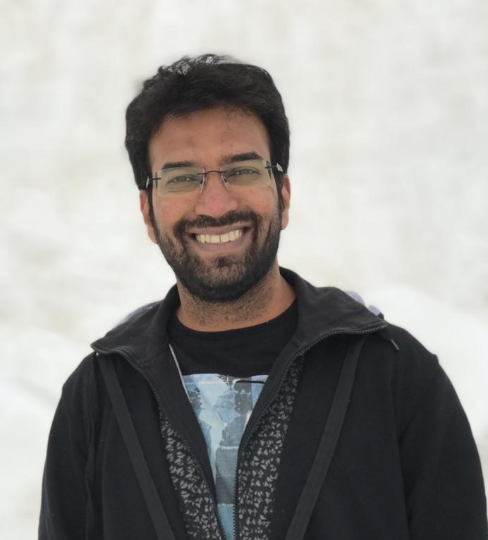

 
 

  

 Hi, I am a postdoctoral research associate in <a href="https://efmlab.nd.edu/">Environmetal Fluid Mechanics Laboratory</a>
at the University of Notre Dame. I am working on the <a href="https://efmlab.nd.edu/research/miso-bob/"> MISO-BOB project</a> investigating the interactions between monsoonal storms and ocean thermodynamics. I am also a visiting scholar at the School of Earth and Environment, University of Leeds where I study the orographic influence of the Western Ghats on the Indian monsoon [ <a  href="https://rmets.onlinelibrary.wiley.com/doi/full/10.1002/qj.4367/"> Phadtare et al. 2022</a>].   

  
<b> Research Interest: </b>  
I primarily study mesoscale weather phenomena, viz., mountain-valley/land-sea breezes, boundary layer processes, mesoscale convective systems, cyclonic storms,  using observations and numerical modeling.

<b> News articles on my research: </b>  
<a href="https://www.thehindu.com/sci-tech/science/what-caused-the-dec-1-2015-chennai-downpour/article24122666.ece">What caused the Dec. 1, 2015 Chennai downpour? </a>, The Hindu  
<a href="https://researchmatters.in/news/look-back-december-2015-floods-chennai-%E2%80%93-what-role-did-eastern-ghats-play">A look back into the December 2015 floods of Chennai</a>, Research Matters

<b>Previous positions:</b> 
Postdoctoral research fellow (Feb. 2020 - Mar. 2021)   <a href="https://ncas.ac.uk/"> National Centre for Atmospheric Science</a>, University of Leeds, UK  

<b>Education:</b>  
Ph.D. (2020), Indian Institute of Science, Bengaluru, India  
M.Tech. (2012), Indian Institute of Science, Bengaluru, India  
B.E. (2008), Sardar Patel College of Engineering, Mumbai, India  

<b>Awards:</b>  
<a href= "https://www.awsar-dst.in/"> DST-AWSAR Award </a> in 2018 by the <em> Dept. of Science and Technology, Govt. of India </em> for <a href ="https://jayeshphadtare.wordpress.com/2018/10/02/tamil-nadu-coast/"> best science article </a>.  

Grantham Fellowship (2012-2017) by the <a href="http://dccc.iisc.ac.in/"> Divecha Centre for Climate Change </a> for Environemtal research.

