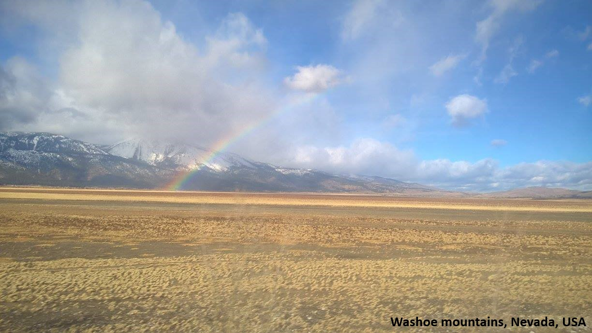

---
layout: page
title: ""
--- 

<html>
<head>
<meta name="viewport" content="width=device-width, initial-scale=1">

</head>
<body>

Hi, thank you for visiting my website. I am a postdoctoral research associate in the <a href="https://efmlab.nd.edu/">Environmental Fluid Mechanics Laboratory</a> at the <a href="https://www.nd.edu/"> University of Notre Dame</a>. I am working on the <a href="https://efmlab.nd.edu/research/miso-bob/"> MISO-BOB project</a> in which I am trying to understand the structure and evolution of the atmospheric boundary layer using observations from ships and aircraft. I am also involved in the <a href = "https://efmlab.nd.edu/research/swex/">SWEX</a> project, which studies the downslope windstorms over the mountains of Southern California. These hot and dry winds fan the  wildfires in this region. Previously, I was at the <a href="https://ncas.ac.uk/"> National Centre for Atmospheric Science (NCAS)</a>, University of Leeds, where I studied the interaction between monsoonal jet and the Western Ghats from observations and model simulations as a part of the <a  href="http://www.met.reading.ac.uk/~sws05agt/improve/"> IMPROVE project </a> 

I did my Ph.D. at the <a href="https://caos.iisc.ac.in/"> Centre for Atmospheric and Oceanic Sciences</a>, Indian Institute of Science, Bangalore. For my Ph.D. thesis, I wrote an <a href="https://jayphd.github.io/tracking/">automated cloud-tracking algorithm </a> to study the organization of deep convection from the INSAT satellite data. With the help of WRF model simulations, I also proposed an orographic blocking mechanism for the extreme rainfall events responsible for the <a href="https://en.wikipedia.org/wiki/2015_South_India_floods"> 2015 South India floods</a>. This was the first <a href="https://doi.org/10.1175/MWR-D-16-0473.1"> study</a> to link extreme rainfall over the east coast of India to the Eastern Ghats mountains. 
 

<h2> Research Interest: </h2> 
<ul>
<li> Mesoscale Dynamics</li>
<li> Orographic Effects</li> 
<li> Air-Sea Interaction </li>
<li> Numerical Weather Prediction </li>
</ul>

  
Inundation of Chennai area photographed by the Indian Air Force rescue team on 2 December 2015. The upstream orographic blocking stagnated the rainstorm over Chennai, causing this flood <a href="https://doi.org/10.1175/MWR-D-16-0473.1"> (Ref). </a> 
  
    
Print media articles on my research:  
<a href="https://www.thehindu.com/sci-tech/science/what-caused-the-dec-1-2015-chennai-downpour/article24122666.ece">What caused the Dec. 1, 2015 Chennai downpour? </a>, The Hindu  
<a href="https://researchmatters.in/news/look-back-december-2015-floods-chennai-what-role-did-eastern-ghats-play">A look back into the December 2015 floods of Chennai</a>, Research Matters

<h2>Education:</h2> 
<ul>
<li> Ph.D. (2020), Indian Institute of Science, Bengaluru, India </li>
<li> M.Tech. (2012), Indian Institute of Science, Bengaluru, India </li>
<li> B.E. (2008), Sardar Patel College of Engineering, Mumbai, India </li>
</ul>

<b> Spreading education:</b> Notebook distribution in Kolar, Karnataka (courtesy: Notebook Drive, IISc)  

  

<a href="https://drive.google.com/file/d/1HeDbnx6wraPzAjtqf10sOUNfcJlXwvdo/view?usp=drive_link"> Curriculum vitae </a>
