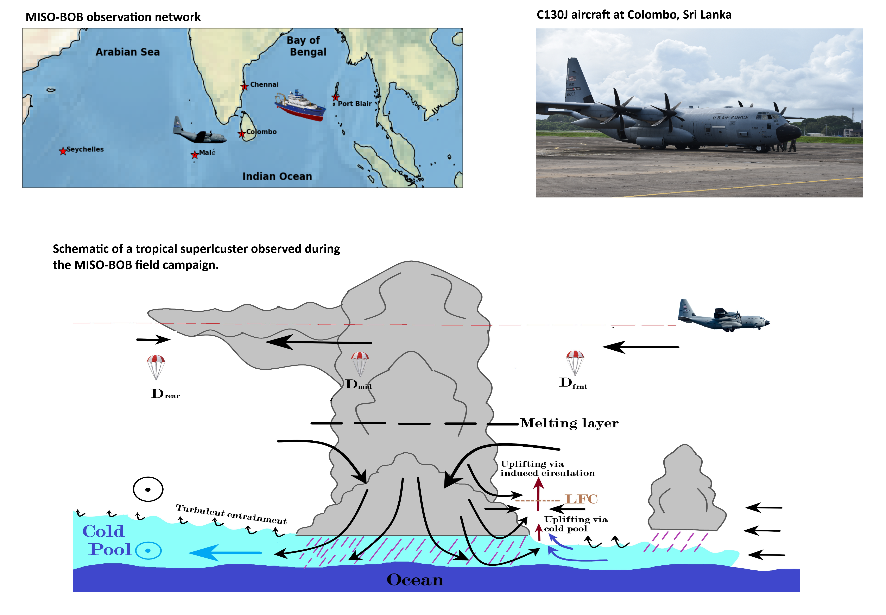

  
<h1>  Monsoon Intraseasonal Oscillation in the Bay of Bengal (MISO-BOB) </h1>

 At the University of Notre Dame, my research is funded through the MISO-BOB project sponsored by the US Office of Naval Research (ONR). The overarching goal of MISO-BOB is to understnd the interplay between strong and weak phases of South Asian Monsoon (SAM) and the Bay of Bengal. The warm basin of Bay of Bengal is a strong attractor for the equatorial weather signal, which otherwise prefer zonal (west-to-east) propagation, during the summer months. As a result, the eastward propagating tropical systems are pulled northwards by the Bay of Bengal. It appears that the strength of SAM is often determined by these nortward propagatring signals, and a complex coupling between ocean and atmosphere determine the course of SAM in a season. Thus, understading and modelling of this interaction is vital for monsoon forecasting. To this end, in situ field obsevations were collected using ships, buoys, WC130J aircraft, and weather baloons (radisondes) in the MISO-BOB project over the SAM region. My primary task is to investigate storm dynamics and atmospheric boundary layer processes with these observations.   
	

 <h1> Orographic influnce on cyclonic systems</h1>

 Understanding the quasi-stationarity of tropical depressions along a coast  
  
<h1>IMPROVE</h1>

 Indian Monsoon Precipitation over Orography: Verification and Enhancement of understanding  
  
<h1>CTCZ</h1>

 Continental Tropical Convergence Zone  
